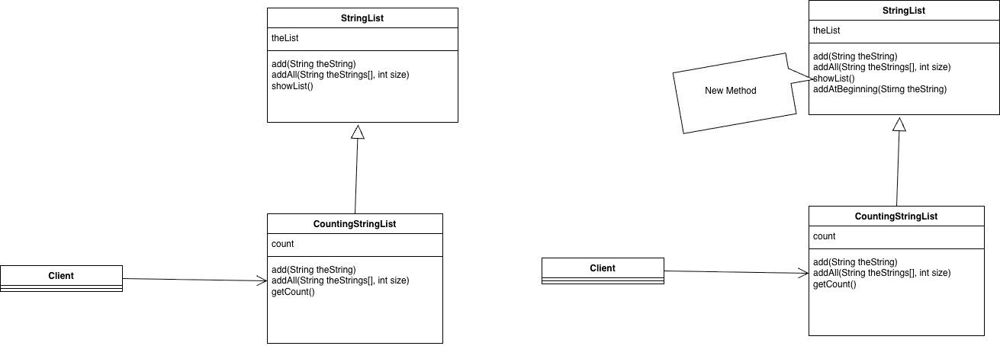
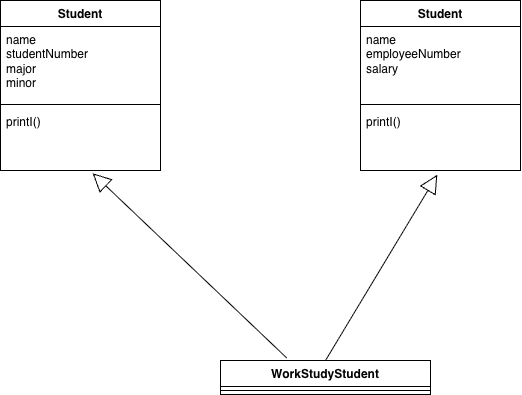

## Inheritance 

### Inheritance problems
- Problem 1. Breaks encapsulation. Check [strings example](src/main/java/strings)
- Problem 2. Adding a new method to parent class could break the child class

- Problem 3. Multiple inheritance, you do not know which parent class to use.
Multiple inheritance is not allowed in Java
